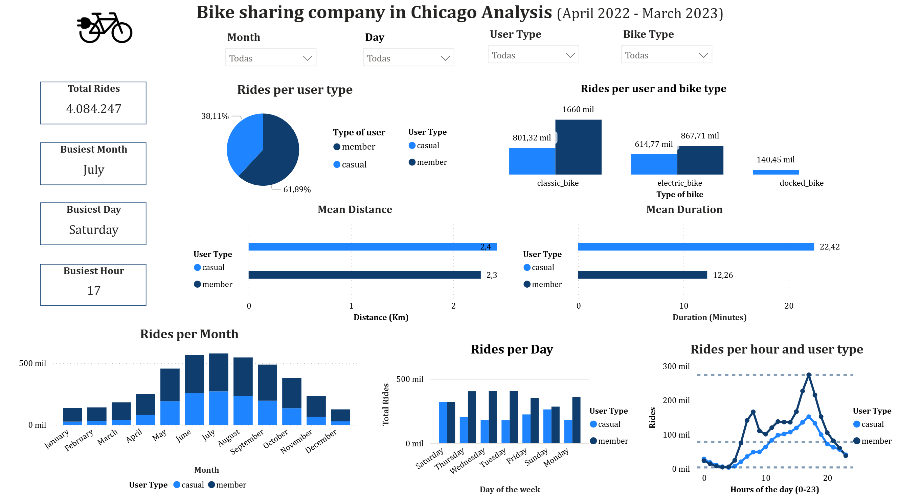

# Bike Sharing Analysis — Chicago

## English

### Overview
Exploratory data analysis project developed as part of the **Google Data Analytics Certificate**. The company offers bike-sharing services in Chicago, Illinois. Customers are segmented into two groups: **Annual Members** and **Casual Riders**. The main goal is to identify usage pattern differences between both groups and generate actionable recommendations to increase annual memberships.

### 🔗 Interactive Dashboard
👉 [View report on Power BI](https://app.powerbi.com/view?r=eyJrIjoiNjYwZGE4ZjYtNDliMy00ZTg4LTg1ZTYtNDc0MjFmMjk2YWYzIiwidCI6ImFjYTUxNjMxLTAwZmUtNDkwZC05MWFiLTE2M2VmODcyNjBlZSIsImMiOjR9)

### Key Findings
- Casual riders use bikes significantly more on **weekends**, while members ride consistently throughout the week
- **Summer months** (June–August) show the highest usage for both groups
- Casual riders take **longer trips** on average than annual members
- Annual members tend to use bikes for **commuting**, casual riders for **leisure**

### Recommendations
1. Seasonal promotions during summer to attract casual riders
2. Short-term memberships to test conversion
3. Special discounts for frequent riders
4. Reward program for long-distance riders

### Methodology
| Phase | Description |
|---|---|
| Ask | Business question: What are the differences between annual members and casual riders? |
| Prepare | Divvy trip data — no personal information included |
| Process | Data cleaning and transformation in Excel |
| Analyze | Power BI for integration, visualization and DAX measures |
| Share | Interactive dashboard published on Power BI |
| Act | Recommendations to increase annual memberships |

### Tech Stack
| Tool | Purpose |
|---|---|
| Excel | Data cleaning and transformation |
| Power BI | Dashboard and DAX measures |
| Python | Distance calculation between coordinates |

---

## Español

### Descripción
Proyecto de análisis exploratorio desarrollado como parte del **Google Data Analytics Certificate**. La empresa ofrece servicios de bicicletas compartidas en Chicago, Illinois. Los clientes se dividen en dos grupos: **Miembros Anuales** y **Riders Casuales**. El objetivo es identificar diferencias en patrones de uso entre ambos grupos y generar recomendaciones para aumentar las membresías anuales.

### 🔗 Dashboard Interactivo
👉 [Ver reporte en Power BI](https://app.powerbi.com/view?r=eyJrIjoiNjYwZGE4ZjYtNDliMy00ZTg4LTg1ZTYtNDc0MjFmMjk2YWYzIiwidCI6ImFjYTUxNjMxLTAwZmUtNDkwZC05MWFiLTE2M2VmODcyNjBlZSIsImMiOjR9)

### Hallazgos Principales
- Los riders casuales usan las bicicletas significativamente más los **fines de semana**, mientras que los miembros tienen un uso consistente durante la semana
- Los **meses de verano** (junio-agosto) muestran el mayor uso en ambos grupos
- Los riders casuales hacen viajes **más largos** en promedio que los miembros anuales
- Los miembros anuales usan las bicicletas para **desplazarse al trabajo**, los casuales para **ocio**

### Recomendaciones
1. Promociones de temporada en verano para atraer riders casuales
2. Membresías de corto plazo para probar la conversión
3. Descuentos especiales para riders frecuentes
4. Programa de recompensas para viajes de larga distancia

